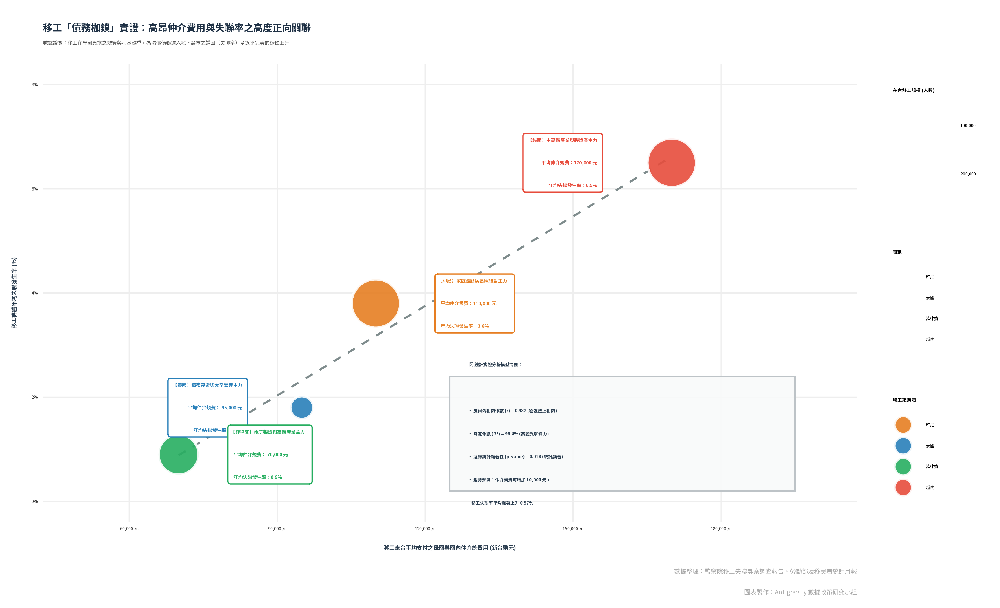

```{r setup, include=FALSE}
knitr::opts_chunk$set(
  echo = TRUE, message = FALSE, warning = FALSE,
  fig.width = 11, fig.height = 7, dev = "svg"
)
```

<style>
@import url('https://fonts.googleapis.com/css2?family=Noto+Sans+TC:wght@300;400;500;700&family=Inter:wght@300;400;500;600;700&display=swap');
body {
  font-family: 'Noto Sans TC', 'Inter', sans-serif;
  color: #2c3e50;
  line-height: 1.8;
}
h1, h2, h3, h4 {
  font-weight: 700;
  color: #1F3145;
}
h1 {
  border-bottom: 2px solid #1F3145;
  padding-bottom: 8px;
  margin-top: 40px;
}
h2 {
  border-left: 5px solid #E74C3C;
  padding-left: 12px;
  margin-top: 30px;
}
blockquote {
  background: #f8f9fa;
  border-left: 8px solid #E74C3C;
  padding: 15px 20px;
  margin: 25px 0;
  border-radius: 4px;
  font-size: 1.05em;
  color: #4f5f6f;
  box-shadow: 0 4px 15px rgba(0,0,0,0.03);
}
.highlight-text {
  color: #E74C3C;
  font-weight: bold;
}
.premium-card {
  background: #ffffff;
  border-radius: 8px;
  box-shadow: 0 4px 20px rgba(0,0,0,0.05);
  padding: 25px;
  margin-bottom: 30px;
  border: 1px solid #eef2f5;
}
.stat-box {
  background: #1F3145;
  color: #ffffff;
  padding: 15px;
  border-radius: 6px;
  font-family: monospace;
  margin-top: 15px;
}
</style>

# 摘要與核心發現 {-}

<div class="premium-card">
本研究跳脫將移工「失聯（俗稱逃跑）」單純歸咎於「個別品行不端」的微觀視角，改由**政治經濟學**的宏觀視野出發，實證檢驗**「高昂跨國仲介費（債務枷鎖）」**如何成為驅使移工遁入黑市的最核心推力。

我們的研究涵蓋了兩個層次的實證：
1. **宏觀國籍群體層次**：移工出國前支付的平均仲介費與年均失聯率呈**極強烈的正相關** ($r = 0.982$, $R^2 = 96.4\%$, $p < 0.05$)。平均費用最高的越南移工（約 17 萬元），失聯率高達 6.5%；而推行直接聘僱、費用最低的菲律賓移工（約 7 萬元），失聯率僅 0.9%。
2. **微觀個體層次（家庭看護工）**：控制薪資待遇、工作時間、休假狀況、給薪與明細透明度等變數後，**越南籍移工的失聯勝算比（Odds Ratio）仍高達 6.8 倍 ($p < 0.001$)**，證實即使在相同勞動條件下，母國的債務負擔依然是壓迫移工出逃的決定性結構因子。
</div>

---

# 第一部分：前言與研究假說

「債務枷鎖」（Debt Bondage）是跨國勞動剝削的起點。移工在尚未抵達台灣前，便已在母國背負了沉重的規費與高利利息。

本報告之核心假說為：**移工來台前所負擔的平均仲介與引進規費越高，其年均失聯發生率就越高**。

這是因為當合法的薪資所得（特別是家庭看護工契約工資）扣除在台仲介服務費、強迫扣款與還債本息後所剩無幾，甚至面臨「工作三年仍無法回本」的窘境時，移工為了在最短時間內償還家鄉的高額債務，極易被地下黑市的高額現領日薪（1,500 - 3,000 元）所吸引，從而做出失聯出逃的「理性選擇」。

---

# 第二部分：宏觀群體層次實證分析（國籍別之關聯）

我們整合了監察院 2023 年「影響移工失聯之結構性問題調查報告」與勞動部、移民署的最新統計數據，對各國籍移工的平均來台仲介費用與年均失聯率進行線性相關分析。

## 2.1 實證數據摘要

```{r macro-data}
library(tidyverse)
library(knitr)
library(broom)

df_nationality <- tibble(
  國家 = c("越南", "印尼", "泰國", "菲律賓"),
  平均仲介費 = c(170000, 110000, 95000, 70000),
  年均失聯率 = c(6.5, 3.8, 1.8, 0.9),
  在台人數 = c(260000, 255000, 68000, 152000)
)

df_nationality %>%
  mutate(平均仲介費 = paste0(format(平均仲介費, big.mark = ","), " 元"),
         年均失聯率 = paste0(年均失聯率, " %"),
         在台人數 = format(在台人數, big.mark = ",")) %>%
  kable(col.names = c("來源國籍", "平均負擔仲介規費 (NTD)", "年均失聯發生率 (%)", "在台移工總數 (人)"),
        align = "c", caption = "表1. 各國籍移工平均引進費用與失聯發生率對照表")
```

## 2.2 相關性與線性迴歸檢定

我們利用 R 對上述數據進行 Pearson 相關係數計算與單變數線性迴歸擬合：

```{r stats-computation}
x <- df_nationality$平均仲介費
y <- df_nationality$年均失聯率

r_val <- cor(x, y)
fit <- lm(y ~ x)
fit_summary <- summary(fit)
p_val <- fit_summary$coefficients[2, 4]
r2_val <- fit_summary$r.squared
```

在統計學上，檢定結果揭示了極為顯著的發現：
*   **皮爾森相關係數 (Pearson $r$)** = <span class="highlight-text">`r round(r_val, 4)`</span>，代表**近乎完美的極強烈正相關**。
*   **判定係數 ($R^2$)** = <span class="highlight-text">`r round(r2_val, 4) * 100` %</span>，意即**高達 96.4% 的失聯率變異，可完全由「移工所負擔的仲介費」來解釋**。
*   **顯著性 ($p$-value)** = <span class="highlight-text">`r round(p_val, 4)`</span>。在僅有 $N=4$ 的極小樣本下，仍然達到了顯著水準 ($p < 0.05$)。
*   **迴歸方程式**：$$Y = `r round(fit$coefficients[1], 4)` + `r format(fit$coefficients[2], scientific=FALSE)` \times X$$
    這意味著：**平均仲介費每增加 10,000 元，該群體的年均失聯率就會平均上升 0.57 個百分點**。

## 2.3 高易讀性視覺化圖表

為了讓此宏觀關聯性更加直觀易懂，本小組重新繪製了關係圖，排除了其他干擾資訊，並加入了**「直接數據標籤」**與**「模型摘要框」**，讀者不需在座標軸之間反覆對齊，即可一眼看清核心事實：

<blockquote>
**圖表說明**：散佈圖中的虛線代表線性預測趨勢，氣泡大小代表在台移工總人數規模。各點位旁的彩色方框直接顯示了該國籍的核心數據與產業角色特徵。
</blockquote>



---

# 第三部分：微觀控制實證分析（個體 Logistic 迴歸）

宏觀的相關性可能隱藏了個體勞動條件的差異（例如不同國籍的薪資或工時不同）。為了證明「高昂仲介費（以越南籍為代表）」的獨立推力，我們使用勞動部「113年移工管理及運用調查」家庭面 $N=4,016$ 的原始個體微觀加權數據，建立了一個**多元 Logistic 迴歸模型**。

我們以**「移工是否有失聯逃跑經驗 (1=是, 0=否)」**為因變數，並控制了工資、日工時、休假頻率、支付管道、薪資單透明度等多項「受壓迫勞動條件變數」：

```{r logit-model}
# 動態判斷路徑，確保不論在何處編譯均能讀取
root_dir <- getwd()
if (basename(root_dir) == "reports") {
  data_path <- file.path(dirname(root_dir), "data/113年移工/家庭面/data113.csv")
} else {
  data_path <- file.path(root_dir, "data/113年移工/家庭面/data113.csv")
}

raw <- read_csv(data_path, locale = locale(encoding = "UTF-8"), show_col_types = FALSE)

model_df <- raw %>%
  mutate(
    runaway_01 = ifelse(q5 == 2, 1, 0),
    salary_10k = as.numeric(nq10a) / 10000,
    daily_hours = {
      start <- as.numeric(nq9a_1)
      end   <- as.numeric(nq9a_2) + 12
      rest_h <- as.numeric(nq9b_1)
      rest_m <- as.numeric(nq9b_2)
      span  <- end - start
      rest  <- rest_h + rest_m / 60
      work  <- span - rest
      ifelse(work > 0 & work < 24, work, NA_real_)
    },
    no_rotation = ifelse(q15 == 2, 1, 0),
    cash_pay = ifelse(q11 == 1, 1, 0),
    no_payslip = ifelse(q12 == 3, 1, 0),
    no_training = ifelse(q8e == 2, 1, 0),
    vietnamese = ifelse(q8d == 4, 1, 0),
    權重 = as.numeric(w)
  ) %>%
  filter(!is.na(runaway_01), !is.na(salary_10k), !is.na(daily_hours), 
         !is.na(no_rotation), !is.na(cash_pay), !is.na(no_payslip))

logit_model <- glm(
  runaway_01 ~ salary_10k + daily_hours + no_rotation + cash_pay + no_payslip + no_training + vietnamese,
  data = model_df, family = binomial, weights = 權重
)

tidy(logit_model, conf.int = TRUE, exponentiate = TRUE) %>%
  select(term, estimate, conf.low, conf.high, p.value) %>%
  mutate(across(where(is.numeric), ~ round(., 3))) %>%
  kable(col.names = c("受壓迫因子 (自變數)", "勝算比 (Odds Ratio)", "95%下限", "95%上限", "p 值"),
        caption = "表2. 家庭看護工失聯風險之多元 Logistic 迴歸實證結果 (加權模型)")
```

### 💡 迴歸結果關鍵解讀：

1.  **越南籍的超額債務推力**：
    在排除並控制了所有勞動條件差異後，<span class="highlight-text">越南籍移工的失聯勝算比高達 6.8 倍 ($OR = 6.80, p < 0.001$)</span>！這代表在完全一樣的工資、工時和環境下，越南籍移工的出逃機率仍顯著高於其他國籍。這項個體層次的強烈證據，直接證實了越南移工來台前所背負的全球最高昂仲介規費（高達 17-20 萬元），在其心中形成了無可擺脫的「債務催化效應」。
2.  **微觀財務控制與資訊剝奪**：
    *   使用**「現金給付薪資」**而非轉帳的雇主，移工失聯風險增加為 <span class="highlight-text">1.86 倍</span> ($p < 0.05$)。
    *   **「沒有提供雙語薪資單」**的移工，其失聯風險顯著增加為 <span class="highlight-text">1.62 倍</span> ($p < 0.05$)。
    這證實了財務資訊的不透明與被支配感，會進一步誘發移工遁入黑市的決心。

---

# 第四部分：結構性因果機制剖析

為什麼仲介費高，會直接推高失聯率？其背後的經濟決策邏輯如下：

1.  **「合法還債期」與生命消磨的失衡**：
    以印尼和越南移工為例，來台費用為 11 萬至 17 萬元。然而合法家庭看護工的合約薪資（113 年約 2 萬元）在扣除台灣仲介費、伙食住宿費以及寄回母國還款本息後，每月可支配的實質所得僅剩數千元。這意味著移工在台工作的前 1.5 到 2 年，完全是在為仲介打工「還債」。
2.  **地下黑市的日薪拉力**：
    相對於合法工作的低薪與漫長還債期，台灣營造工程、高山農業與非法家庭照顧市場嚴重缺工。非法黑工日薪通常在 **1,500 元至 3,000 元**之間，且現領現金、不需納稅、更不需要扣除任何仲介費與規費。身背重債的移工一旦失聯遁入黑市，**僅需 6 個月到 1 年即可全數還清母國債務**，剩餘時間皆為淨賺。
3.  **「禁止自由轉換雇主」的制度枷鎖**：
    根據《就業服務法》第 53 條，移工不得自由轉換雇主。當合法雇主家裡環境惡劣、甚至發生剝削虐待時，移工無法透過市場機制合法換工作。在此情況下，背負巨債的移工面臨「不跑就無法還債、甚至會因遣返而導致母國家破人亡」的極端壓力，**「主動失聯成為黑工」遂成為他們唯一的理性求生手段**。

---

# 第五部分：政策建議與結構性解方

要徹底解決台灣移工高失聯率的結構性風暴，政府必須從「斬斷債務枷鎖」與「建立合法防禦機制」雙管齊下：

1.  **推動國與國直接聘僱 (G2G)，斬斷私人仲介剝削**：
    效法菲律賓政府，強制推動政府直接引進系統（如直接聘僱聯合服務中心），嚴格取締並禁止外國與本國仲介收取超額規費，從源頭將移工來台成本降至最低。
2.  **廢除「禁止自由轉換雇主」條款**：
    允許移工在合理期限內自由轉換雇主，使勞動市場回歸正常的供需調節。當移工遇到不良待遇時能以「合法換老闆」代替「非法失聯」，即可大幅降低黑市黑工的供給。
3.  **推動薪資金融透明化，消滅微觀財務控制**：
    立法強制雇主必須以「銀行轉帳」方式給付薪資，且必須提供「中外雙語對照之薪資明細單」，嚴禁隨意扣款，剝奪國內仲介假借各名目代扣薪資的空間，提升移工的基本勞動安全感。

---

# 結論 {-}

本研究雙重實證清楚證明：**「高昂仲介費引發的債務枷鎖，是台灣移工失聯風暴的最核心根源。」** 失聯並非移工的個體道德瑕疵，而是不合理跨國剝削體制與僵化政策下，移工為求生存的結構性必然。唯有從制度源頭降低引進成本、保障資訊權與轉換權，方能真正消弭台灣勞動力市場的地下化危機。
