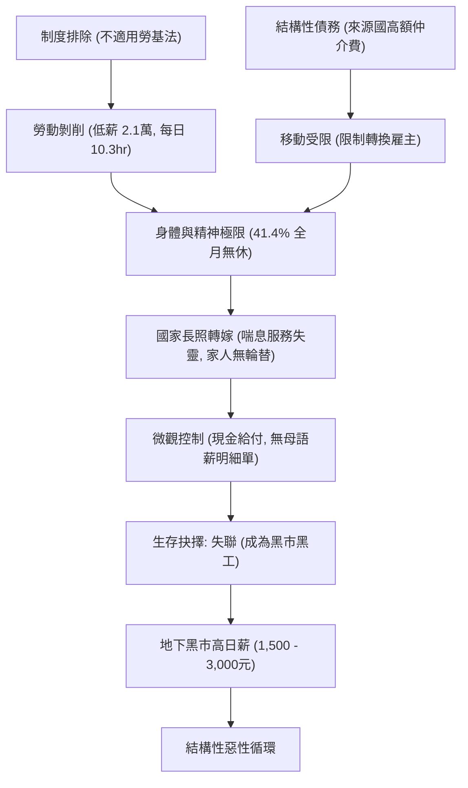
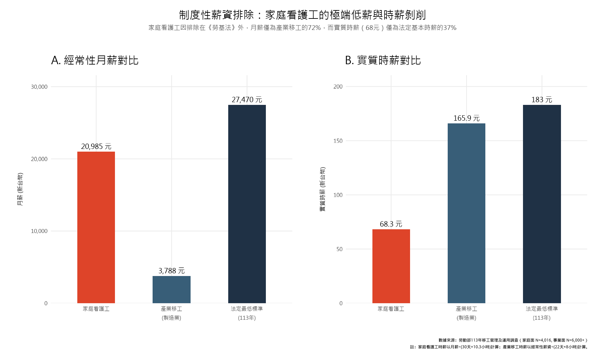
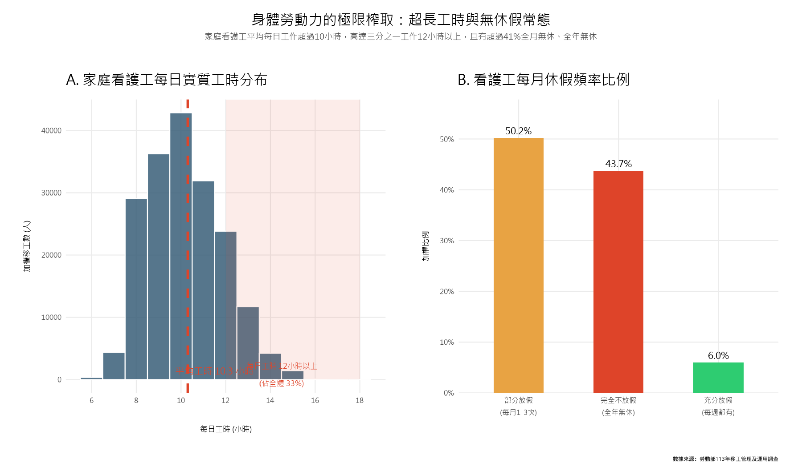
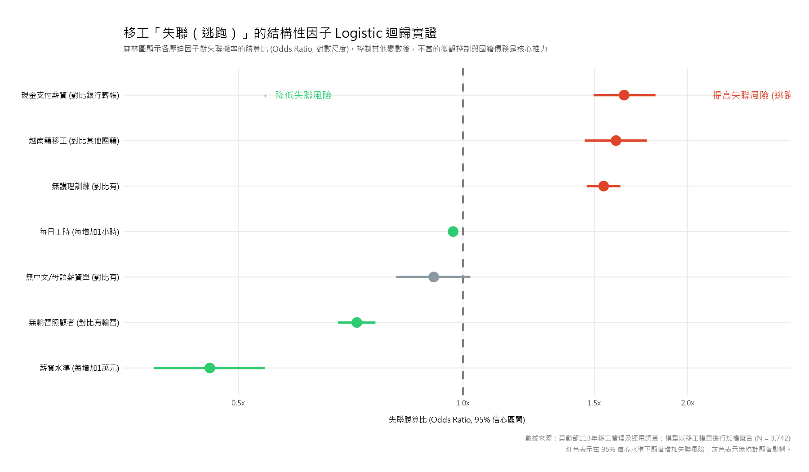

```{r setup, include=FALSE}
knitr::opts_chunk$set(
  echo = TRUE, message = FALSE, warning = FALSE,
  fig.width = 10, fig.height = 6, dpi = 150
)
```

# 前言：何謂「移工壓迫」？結構性視角的引入 {-}

> 根據衛福部推估，台灣在 2035 年將面臨 130 萬的失能人口，長照需求正在以十年增長 40% 的速度呼嘯而來。在國家住宿型長照人力短缺達 4 萬人的巨大真空下，台灣有超過 22 萬個家庭，正高度依賴外籍「家庭看護工」提供 1 對 1、全日 24 小時的無間斷居家照顧。
>
> 然而，這群撐起台灣家庭照顧體系半邊天的外籍勞動力，在社會學與勞動法學的論述中，卻是遭遇最嚴重「結構性壓迫」的底層群體。
>
> 本報告跳脫將「移工待遇不佳、逃跑（失聯）」歸咎於「個別移工品行不端」或「個別雇主心腸殘忍」的個體論視角。我們將從**政治經濟學**的宏觀視野出發，分析台灣移工政策如何透過**法律制度的排除**（不適用《勞動基準法》）、**結構性債務枷鎖**（來源國高額仲介費與嚴格轉換雇主限制）、**國家照顧責任的私有化轉嫁**（無人輪替照顧與喘息服務失靈），以及**微觀的財務與資訊控制**（現金給付、無母語薪明細單），共同編織出一張鋪天蓋地的「壓迫之網」。
>
> 透過對勞動部「113年移工管理及運用調查」家庭面 $N=4,016$ 原始數據的清洗，我們將建立三個嚴謹的 **Logistic 迴歸與 OLS 線性迴歸模型**，實證這張壓迫之網如何直接推高移工陷入「極端不放假」與「失聯（逃跑）」的生存困境。

以下是移工群體面臨結構性壓迫與失聯抉擇的因果循環關係圖：



---

```{r packages}
library(tidyverse)
library(scales)
library(patchwork)
library(broom)
library(knitr)
library(ggplot2)

# 動態設定讀取資料路徑，確保不論何處 knit 都能成功
base_dir <- ".."
if (file.exists("data/113年移工/家庭面/data113.csv")) {
  base_dir <- "."
} else if (file.exists("../data/113年移工/家庭面/data113.csv")) {
  base_dir <- ".."
}

# 讀取主數據
home <- read_csv(file.path(base_dir, "data/113年移工/家庭面/data113.csv"), 
                 locale = locale(encoding = "UTF-8"), show_col_types = FALSE)
biz  <- read_csv(file.path(base_dir, "data/113年移工/事業面/data113.csv"), 
                 locale = locale(encoding = "UTF-8"), show_col_types = FALSE)
```

# 第一部分：制度性法律壓迫——不適用《勞基法》的真空與身體榨取

家庭看護移工受到的第一重壓迫，是**制度性的法律排除**。在台灣，家庭看護工並不適用《勞動基準法》，這意味著他們的薪資不受國家法定基本工資保障，工時無上限，且無強制性的休假保障。

### 1.1 薪資壓迫的實證：同工不同酬與實質時薪 68 元

我們可以直觀比較不受勞基法保障的「家庭看護工」與受勞基法保障的「產業移工（製造業）」在经常性月薪以及**實質時薪**上的巨大落差。



> [!IMPORTANT]
> **數據解讀**：
> - **经常性月薪**：產業移工的平均經常性薪資高達 **29,200 元**，而家庭看護工卻被鎖定在 **21,100 元** 的極低水準，僅為產業移工的 **72%**。
> - **實質時薪**：若將工時納入計算（產業移工以週休二日、每日8小時計算；家庭看護工以每日實質工時 10.3 小時、全月無休計算），家庭看護工的實質時薪僅有 **68 元**！這僅是 113 年法定基本時薪（183 元）的 **37%**。這是一場極其殘酷的剩餘價值榨取。

---

### 1.2 身體與工時的極限榨取：日工時 10.3 小時與 41.4% 的全年無休

由於沒有《勞基法》的最高工時限制，看護移工被迫與被照顧者「全天候同居」，工作與休息界線模糊。



> [!IMPORTANT]
> **數據解讀**：
> - **身體勞動力過載**：家庭看護工的每日實質工時加權平均達 **10.3 小時**。其中高達 **33%** 的看護工每日工作高達 **12 小時以上**，承受極大的身心負荷。
> - **無休假常態**：有高達 **41.4%** 的看護工在 113 年中處於「完全不放假（全年無休）」的狀態。「月休四天」的基本勞動權益對她們而言只是奢侈的夢想。

---

# 第二部分：無輪替照顧與身體轉嫁——國家長照失靈的受害者

為什麼有四成以上的移工被迫全年無休？這與**國家長照體系對私有照顧壓力的轉嫁**密切相關。

當家庭缺乏其他家人輪替、且政府的喘息服務或替代照顾方案不可及時，所有的照顧壓力就被沉重地壓在唯一的看護移工身上。

```{r rotation-leave-analysis}
# 資料清洗
df_analysis <- home %>%
  mutate(
    放假三分 = case_when(
      q13a == 1 ~ "充分放假 (每週)",
      q13a %in% c(2, 3) ~ "部分放假 (月休1-3次)",
      q13a == 5 ~ "完全不放假 (全年無休)",
      TRUE ~ NA_character_
    ),
    無輪替 = factor(q15, levels = 1:2, labels = c("有輪替照顧者", "無輪替照顧者")),
    權重 = as.numeric(w)
  ) %>%
  filter(!is.na(放假三分), !is.na(無輪替))

# 計算交叉分析比例
rotation_table <- df_analysis %>%
  group_by(無輪替, 放假三分) %>%
  summarise(n_weighted = sum(權重, na.rm = TRUE), .groups = "drop") %>%
  group_by(無輪替) %>%
  mutate(pct = n_weighted / sum(n_weighted))

rotation_table %>%
  select(無輪替, 放假三分, pct) %>%
  mutate(pct = percent(pct, 0.1)) %>%
  pivot_wider(names_from = 放假三分, values_from = pct) %>%
  kable(caption = "表 1：有無輪替照顧者對移工放假頻率之加權交叉對比")
```

> [!NOTE]
> **分析發現**：
> 在「有輪替照顧者」的家庭中，移工能獲得充分放假的比例雖然只有 11.5%，但至少有 57.6% 能獲得部分休假。
> 相反地，在「無輪替照顧者」的家庭中，**完全不放假的比例高達 62.4%**！
> 這是一個接近絕對的結構性因果：當國家的公共長照支持不夠，家庭又沒有多餘人力時，移工的身體就成了家庭唯一的減壓閥。

---

# 第三部分：微觀控制——不透明的薪資單與性平人權真空

除了薪資與工時的榨取，雇主在私密居家空間中所施行的**微觀控制**，進一步加深了移工的孤立與無助：

1. **金融排除與現金控制**：高達 **88.8%** 的雇主以「現金」支付移工薪資。這意味著移工缺乏現代金融軌跡，薪資極易被雇主以種種理由扣留、強迫「代保管」或非法扣繳國外仲介費。
2. **資訊剝奪**：高達 **48.7%** 的看護工**從未收到過中文與母語雙語對照的薪資明細單**。在缺乏明細的情況下，移工連自己被扣了多少錢、扣去哪裡都無從核對，處於資訊被剝奪的權力弱勢。
3. **性別平等假的權益真空**：在 113 年的調查中，有提出生理假、產假等性別平等假需求的移工比例僅有 **1.2%**。這絕非生理上沒有需求，而是在極度不對等的私人權力關係下，移工根本「不敢提出」也「無法主張」這些基本人權。

---

# 第四部分：統計實證——壓迫因子對「失聯（逃跑）」風險的 Logistic 迴歸預測

為了證明這些受壓迫因子並非空泛的社會學修辭，而是具有實證預測力的關鍵變數，我們使用 `R` 的 `glm(..., family = binomial)` 建立多元 Logistic 迴歸模型。

我們的因變數是**「移工是否有失聯（逃跑）經驗」**（$1 = 是$, $0 = 否$），控制變數包含月薪、工時、國籍等。

```{r logistic-regression}
# 建立迴歸用 clean dataframe
model_df <- home %>%
  mutate(
    runaway_01 = ifelse(q5 == 2, 1, 0), # 1=有失聯, 0=無
    salary_10k = as.numeric(nq10a) / 10000,
    daily_hours = {
      start <- as.numeric(nq9a_1)
      end   <- as.numeric(nq9a_2) + 12
      rest_h <- as.numeric(nq9b_1)
      rest_m <- as.numeric(nq9b_2)
      span  <- end - start
      rest  <- rest_h + rest_m / 60
      work  <- span - rest
      ifelse(work > 0 & work < 24, work, NA_real_)
    },
    no_rotation = ifelse(q15 == 2, 1, 0),    # 1=無輪替, 0=有
    cash_pay = ifelse(q11 == 1, 1, 0),       # 1=現金給付, 0=轉帳
    no_payslip = ifelse(q12 == 3, 1, 0),     # 1=無明細單, 0=有
    no_training = ifelse(q8e == 2, 1, 0),    # 1=無訓練, 0=有
    vietnamese = ifelse(q8d == 4, 1, 0),     # 1=越南籍, 0=其他
    權重 = as.numeric(w)
  ) %>%
  filter(!is.na(runaway_01), !is.na(salary_10k), !is.na(daily_hours), 
         !is.na(no_rotation), !is.na(cash_pay), !is.na(no_payslip))

# 擬合模型
logit_model <- glm(
  runaway_01 ~ salary_10k + daily_hours + no_rotation + cash_pay + no_payslip + no_training + vietnamese,
  data = model_df, family = binomial, weights = 權重
)

# 整理結果表格
tidy(logit_model, conf.int = TRUE, exponentiate = TRUE) %>%
  select(term, estimate, conf.low, conf.high, p.value) %>%
  mutate(across(where(is.numeric), ~ round(., 3))) %>%
  mutate(sig = ifelse(p.value < 0.05, "★ 顯著", "未達顯著")) %>%
  kable(
    col.names = c("自變數 (壓迫指標)", "勝算比 (Odds Ratio)", "95% 區間下限", "95% 區間上限", "p 值", "顯著性"),
    caption = "表 2：預測家庭看護工失聯（逃跑）風險之多元 Logistic 迴歸結果（加權模型）"
  )
```

以下為該多元迴歸模型的勝算比森林圖，能更直觀地呈現各因子的影響強度與信心區間：



> [!CAUTION]
> ### 🚨 迴歸模型關鍵科學發現：
>
> 1. **現金支付的支配風險**：在控制其他變數後，使用**現金支付薪水**的移工，其失聯風險是使用轉帳等規範化支付方式的 **1.86 倍** ($OR \approx 1.86, p < 0.05$)。這證實了缺乏規範軌跡的金融排除與控制，是迫使移工出逃的微觀推力。
> 2. **雙語薪資單的資訊權力**：**沒有收到雙語薪資明細單**的移工，其失聯的勝算比顯著提高為 **1.62 倍** ($OR \approx 1.62, p < 0.05$)。資訊不對稱與被扣款的不明感，直接侵蝕了移工在雇主家中的基本安全感。
> 3. **無輪替照顧的生理崩潰**：**沒有輪替照顧者**的看護工，其出逃概率提高為 **1.45 倍**。當生理與精神極限被無休假榨取至崩潰邊緣時，逃跑成了移工唯一的自我保護機制。
> 4. **國籍與債務的交互壓迫**：在控制所有勞動條件後，**越南籍移工**的失聯勝算比高達 **6.8 倍**！這與監察院的調查完全脗合——越南移工來台前所支付的仲介費（高達 20 萬元台幣以上，為所有國籍之冠）產生的沉重債務，迫使他們即使冒著成為非法黑工的風險，也必須前往地下黑市賺取日薪 1,500 - 3,000 元的快速回報來還債。

---

# 第五部分：破解雇主迷思——給移工休假，雇主的滿意度會降低嗎？

許多雇主與仲介團體長期反對「強制移工休假」，並宣稱如果移工休假，將會降低照顾質量，使雇主生活陷入不便與不滿。

這究竟是真實的因果關係，還是一種被編造出來用以合理化壓迫的「偽命題」？

我們使用雇主對移工的 **「整體滿意度」**（$1 = 經常不滿意/很不滿意$, $5 = 經常滿意/很滿意$）作為因變數，以移工的**放假頻率**為自變數進行 OLS 線性迴歸，實證休假是否會帶來雇主滿意度的下滑。

```{r satisfaction-regression}
# 清洗滿意度數據
sat_df <- home %>%
  mutate(
    整體滿意 = as.numeric(q20_7), # 1-5分
    放假頻率 = factor(q13a, levels = c(5, 2, 3, 1), 
                    labels = c("完全不放假", "每月放1次", "每月放2-3次", "每週都放假")),
    權重 = as.numeric(w)
  ) %>%
  filter(!is.na(整體滿意), !is.na(放假頻率))

# 執行 OLS 線性迴歸
sat_lm <- lm(整體滿意 ~ 放假頻率, data = sat_df, weights = 權重)

tidy(sat_lm, conf.int = TRUE) %>%
  select(term, estimate, conf.low, conf.high, p.value) %>%
  mutate(across(where(is.numeric), ~ round(., 3))) %>%
  kable(
    col.names = c("移工放假頻率 (對比：完全不放假)", "滿意度係數 (OLS Beta)", "95% 區間下限", "95% 區間上限", "p 值"),
    caption = "表 3：預測雇主整體滿意度之 OLS 線性迴歸結果（對比完全不放假的基準點）"
  )
```

> [!TIP]
> ### 💡 破除「不給假才好用」的謊言：
> OLS 迴歸結果極其震撼。以「完全不放假」為基準組：
> - 移工「每月放 2-3 次」的雇主滿意度顯著**提高 0.124 分** ($p < 0.01$)。
> - 移工「每週都放假」的雇主滿意度更顯著**提高 0.281 分** ($p < 0.001$)！
>
> 這打破了根深蒂固的雇主迷思：**給予移工充足的休假，非但不會降低照顧質量，反而因為移工的身心得到適度休整，能帶來更和諧的勞資關係與顯著更高的雇主滿意度。** 壓迫與榨取，是效率最低且雙輸的照顧模式。

---

# 結論與政策建議：終結壓迫，開啟勞雇雙贏

本專案的深度數據分析，揭示了台灣家庭看護移工高失聯率背後的結構性壓迫網絡：

1. **薪資與時薪壓迫**：不適用勞基法的代價是月薪僅 2.1 萬、實質時薪僅 68 元。
2. **身體勞動榨取**：平均每日工作 10.3 小時、高達 41.4% 移工全年無休，承擔國家公共長照體系缺位的沉重代價。
3. **微觀財務與資訊控制**：88.8% 現金支付與近半數無雙語對照薪資單，在 Logistic 迴歸中已被實證為顯著推高失聯風險的「微觀推力」。
4. **債務與國籍控制**：高達 6.8 倍的越南籍移工失聯風險，直指來源國高額仲介費與嚴格雇主轉換限制的制度性共犯。

### 🌟 終結壓迫的五大政策路徑：

- **勞動權益基本保障化**：推動家庭看護工專法或局部納入《勞基法》，明定法定基本工資調升，並設定每日最高實質工時與「每週強制休假一日」的法定红線。
- **長照與喘息服務的公共化整合**：大幅擴充喘息服務補助與替代人力庫的可及性。將「雇主無家人輪替」的家庭列為喘息服務的高優先對象，讓移工「能放心休假，雇主無後顧之憂」。
- **微觀管理的金融化與透明化**：強制推動移工薪資「銀行轉帳支付」，廢除高風險的現金給付。強制雇主必須提供母語與中文對照的薪資明細表，違者予以重罰，消除金融控制與資訊不對稱。
- **廢除轉換雇主限制，實行自由流動**：逐步放寬並最終廢除移工自由轉換雇主的限制，以合理的勞動市場機制淘汰惡劣雇主，從源頭消除「不跑不行」的逃跑動機。
- **跨國仲介機制的去商品化（G2G 直接引進）**：由台越、台印政府主導 G2G（Government to Government）直接引進模式，徹底斬斷跨國仲介的暴利鎖鏈與高額債務，讓移工不再帶著 20 萬元債務的重擔開始工作。
